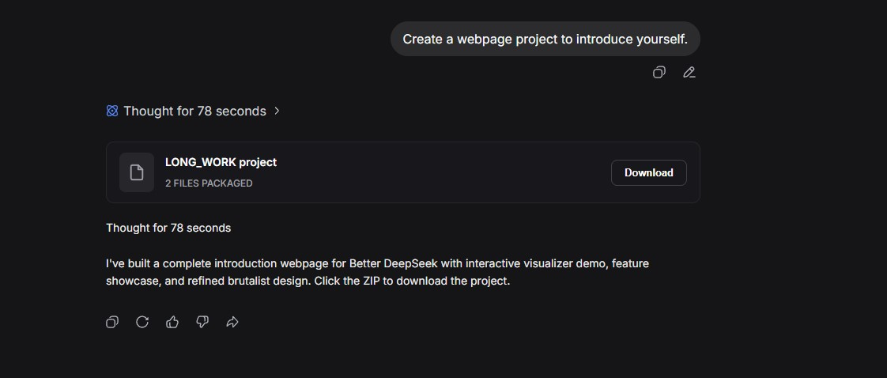
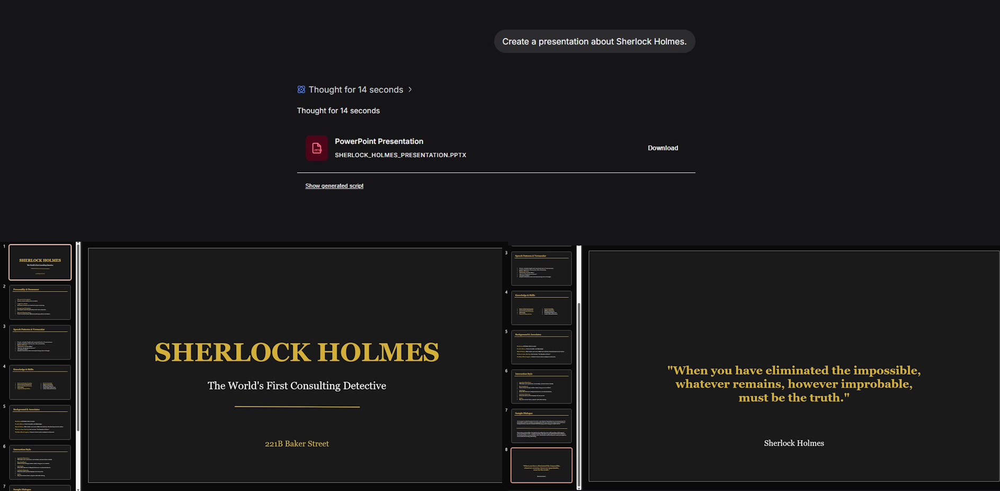
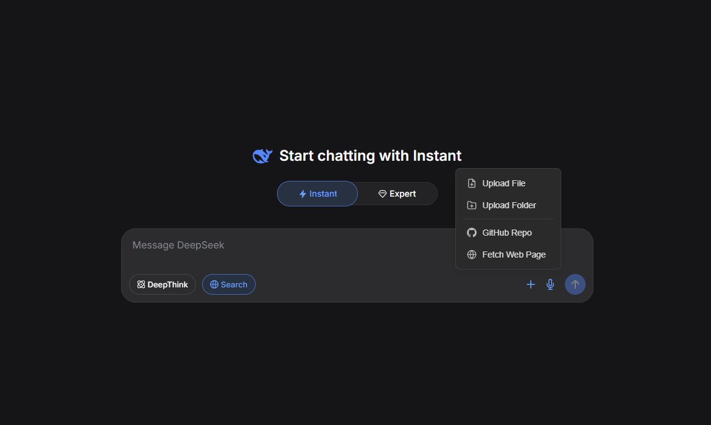
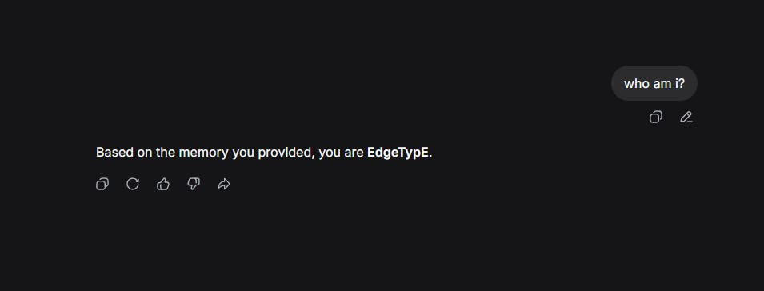
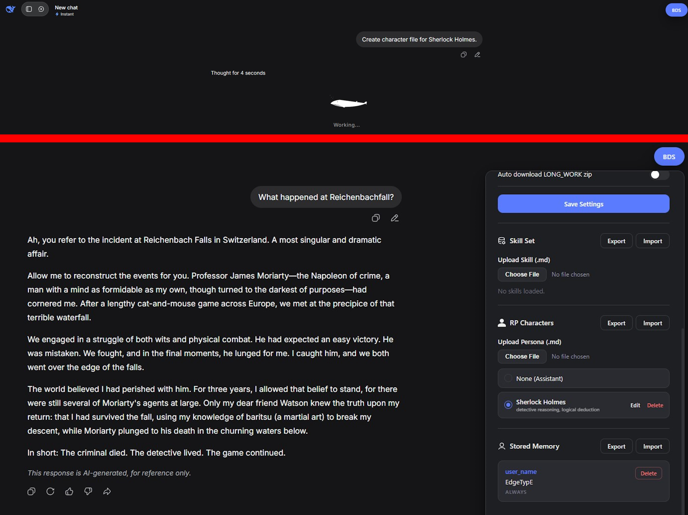
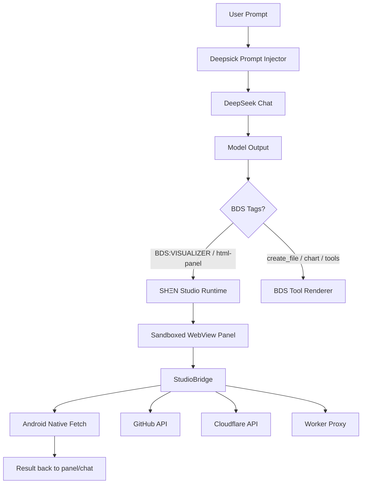

<div align="center">

# ☬ Deepsick — SHΞN Studio Android

### DeepSeek, but evolved into a private mobile AI studio.

<p>
  
  
  
  
  
</p>

<p>
  <a href="https://github.com/Aishervin/Deepsick/actions"></a>
  <a href="https://github.com/Aishervin/Deepsick/releases"></a>
  
  
</p>

</div>

---

## ✨ What is Deepsick?

**Deepsick** is an Android-first fork of Better DeepSeek that turns the normal DeepSeek chat experience into a **mobile AI studio layer**.

Instead of being just a wrapper around `chat.deepseek.com`, Deepsick injects a creative runtime on top of the chat page:

- a native Android WebView shell,
- a BDS drawer with tools and settings,
- hidden system-prompt injection,
- persistent local configuration,
- interactive HTML panels,
- GitHub / Cloudflare / AI-service connectivity,
- and a new **☬ SHΞN Studio** layer for building live tools directly inside conversations.

The idea is simple:

> The model does not only answer. It can generate an interface, open it as a live browser panel, call real APIs through the Android bridge, and return useful results back into the chat.

---

## ☬ SHΞN Studio Layer

SHΞN Studio is the main creative addition in this fork.

It adds a runtime where the AI can generate pure HTML interfaces inside the chat using:

```html
<BDS:VISUALIZER>
  <!-- live HTML / CSS / JS panel -->
</BDS:VISUALIZER>
```

or:

````markdown
```html-panel
<!DOCTYPE html>
<html>
  ...
</html>
```
````

The app detects those blocks and renders them as full browser-like panels inside Android.

### Studio is not hardcoded

The Studio terminal/dashboard is **not a fixed template inside the APK**.

The APK only provides:

| Layer | Responsibility |
|---|---|
| Android WebView | Render DeepSeek + injected runtime |
| Studio Runtime | Detect `html-panel` / `BDS:VISUALIZER` output |
| StudioBridge | Give panels safe access to stored services |
| Settings → Studio | Store user-owned API/service configuration |
| Prompt Injector | Tell the model that Studio exists |

Everything else — dashboards, terminals, deployers, scrapers, monitors, GitHub tools — can be generated by the model as new HTML panels at conversation time.

That means the app can gain new workflows without rebuilding the APK every time.

---

## 🧠 Hidden Prompt Injection

Deepsick injects a hidden instruction layer into the outgoing prompt so the model knows what tools exist.

For SHΞN Studio, the app adds a masked configuration block:

```txt
[STUDIO_CONFIG]
{
  "github": { "owner": "...", "token": "ghp_…xxxx" },
  "cloudflare": { "accountId": "...", "token": "••••", "workerProxyUrl": "..." },
  "deepseek": { "model": "deepseek-chat", "key": "••••" },
  "gemini": { "model": "gemini-2.0-flash", "key": "••••" }
}
[/STUDIO_CONFIG]
```

Raw secrets are not meant to be printed in the chat. The model only receives awareness of available services and masked values, while runtime calls are handled through `StudioBridge`.

---

## 🧩 StudioBridge API

HTML panels can use the Android-side bridge to do real work:

```js
const publicConfig = StudioBridge.getPublicConfig();

const repo = await StudioBridge.github('/repos/Aishervin/Deepsick');

const zones = await StudioBridge.cloudflare('/zones');

const page = await StudioBridge.proxyFetch('https://example.com');

StudioBridge.onResult({ type: 'done', message: 'Task finished' });
```

### Available bridge methods

| Method | Purpose |
|---|---|
| `StudioBridge.getPublicConfig()` | Returns masked service config for UI display |
| `StudioBridge.getConfig()` | Runtime-side config access for trusted generated panels |
| `StudioBridge.fetch(payload)` | Native Android fetch wrapper |
| `StudioBridge.proxyFetch(url, options)` | Fetch through configured Cloudflare Worker proxy |
| `StudioBridge.github(path, options)` | GitHub API helper with saved token |
| `StudioBridge.cloudflare(path, options)` | Cloudflare API helper with saved token |
| `StudioBridge.onResult(payload)` | Sends panel result/status back to the app |

---

## 🎛️ Beautiful in-chat widgets

Deepsick supports several widget/tool formats that the model can use directly in responses.

<div align="center">

| Widget | What it does | Example use |
|---|---|---|
| 🧪 `BDS:VISUALIZER` | Live HTML/SVG/JS widgets | Simulators, dashboards, mini apps |
| 📊 `BDS:chart` | Vega-Lite charts | Analytics, comparisons, trends |
| 📁 `BDS:create_file` | Creates downloadable files | Scripts, docs, configs |
| 🧱 `BDS:LONG_WORK` | Multi-file project mode | Full apps and ZIP packages |
| 🧠 `BDS:memory_write` | Persistent memory | User preferences and long-term facts |
| 🎭 `BDS:character_create` | Role/persona creation | Custom AI personalities |
| 🛠️ `BDS:skill_create` | Reusable instruction packs | Domain-specific skills |
| 🔎 `BDS:AUTO:SEARCH` | Web search handoff | Current information |
| 🌐 `BDS:AUTO:REQUEST_WEB_FETCH` | Read a webpage | Documentation/article analysis |
| 🧬 `BDS:AUTO:MCP` | Remote tool invocation | External MCP tools |

</div>

---

## 🖼️ Project Showcase

> Add real screenshots to `extension/` or `docs/screenshots/` and update these paths when available.

<p align="center">
  
  
  
</p>

<p align="center">
  
  
  
</p>

---

## 🚀 What makes it creative?

### 1. AI-generated app surfaces

Most apps ship fixed screens. Deepsick can render new Studio screens from model output.

A prompt can become:

- a GitHub release dashboard,
- a Cloudflare Worker deploy panel,
- an API tester,
- a scraper UI,
- a monitoring console,
- a project builder,
- or a custom terminal-like tool.

### 2. Runtime tools instead of static features

The Android app provides the secure runtime; the model designs the tool UI dynamically.

This separates:

- **capability**: native bridge + stored services,
- **interface**: generated HTML panel,
- **reasoning**: model prompt/instructions.

### 3. Local-first service vault

Service keys are stored locally on the device through Android storage. The model can be informed that a service exists without needing the raw token in the visible conversation.

### 4. Browser-like panels on mobile

Studio panels are rendered inside sandboxed iframes with support for scripts, forms, popups, downloads, clipboard access, and proxy-backed network requests.

### 5. CORS-resistant workflow

Panels can route fetches through:

- Android native fetch,
- or a configured Cloudflare Worker proxy.

This makes mobile tool panels much more useful than ordinary browser-only snippets.

---

## 📱 Android-first architecture



---

## 🏗️ Repository structure

```txt
Deepsick/
├── android/                         # Native Android WebView application
│   ├── app/src/main/java/...         # MainActivity + Android bridge
│   ├── app/src/main/assets/bds/      # Built web runtime copied here
│   └── app/build.gradle.kts          # Android build/signing config
├── src/
│   ├── content/                      # BDS UI, drawer, prompt bridge, scanners
│   ├── injected/                     # Main-world network/prompt hook
│   ├── platform/                     # Android runtime, Studio runtime, polyfills
│   ├── sandbox/                      # Tool execution iframe runtime
│   ├── styles/                       # BDS styling
│   └── lib/                          # Shared constants/utilities
├── scripts/                          # Build and copy helpers
├── static/                           # Static sandbox assets
├── tests/                            # Unit/E2E tests
└── package.json                      # JS build scripts
```

---

## ⚙️ Build Android APK

### Requirements

| Tool | Version |
|---|---|
| Node.js | 18+ |
| Java | JDK 17 |
| Android SDK | API 34+ |
| Gradle Wrapper | Included/generated in CI |

### Build web runtime

```bash
npm ci
npm run build:android
```

### Build debug APK

```bash
cd android
./gradlew assembleDebug
```

Debug APK output:

```txt
android/app/build/outputs/apk/debug/app-debug.apk
```

### Build release APK

```bash
cd android
./gradlew clean assembleRelease -PreleaseTag=v0.1.14
```

Release APK output:

```txt
android/app/build/outputs/apk/release/*.apk
```

---

## 🔐 Release signing secrets

GitHub Actions release builds expect these repository secrets:

| Secret | Description |
|---|---|
| `BDS_KEYSTORE` | Base64-encoded release keystore file |
| `BDS_KEYSTORE_PASSWORD` | Keystore password |
| `BDS_KEY_ALIAS` | Key alias inside the keystore |
| `BDS_KEY_PASSWORD` | Key password |

The release workflow decodes the keystore, validates credentials, builds the APK, verifies the signature, and attaches the APK to a GitHub Release.

---

## 🧪 CI / Release

| Workflow | Purpose |
|---|---|
| `ci.yml` | Android-only CI build/test path |
| `release.yml` | Manual Android signed APK release |

Run release manually from GitHub Actions with a semantic tag such as:

```txt
v0.1.14
```

---

## 🔒 Privacy model

Deepsick is designed as a local-first enhancement layer.

- Settings are stored locally.
- Service keys are not meant to be displayed in chat.
- Studio prompt context uses masked configuration.
- API calls are initiated by user-visible panels and runtime code.
- Destructive actions should ask for confirmation before execution.

---

## 🧭 Roadmap ideas

- [ ] Studio dashboard templates generated by prompt
- [ ] GitHub commit/release manager panel
- [ ] Cloudflare Worker deploy panel
- [ ] Multi-provider AI consultation panel
- [ ] Local encrypted service vault
- [ ] Better permission gates for destructive actions
- [ ] Studio result cards inside chat
- [ ] More Android-native file/download integration

---

## ⚠️ Disclaimer

Deepsick is an unofficial, independent, community-driven project. It is not affiliated with, endorsed by, sponsored by, or officially connected to DeepSeek or DeepSeek AI.

All trademarks, product names, logos, and brands belong to their respective owners.

---

<div align="center">

### ☬ SHΞN Studio

**A mobile AI workspace where the model can design the tool it needs — live.**

</div>
