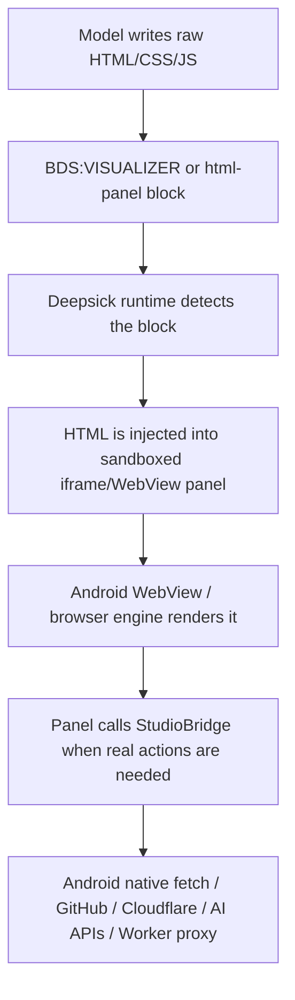
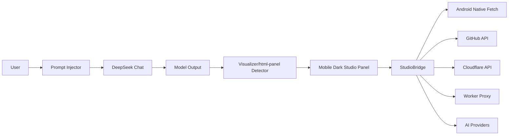

<div align="center">

# ☬ Deepsick — SHΞN Studio Android

### یک لایه‌ی اندرویدی برای تبدیل DeepSeek به استودیوی اجرایی، ترمینال HTML و ابزارساز زنده

<p>
  
  
  
  
</p>

<p>
  <a href="https://github.com/Aishervin/Deepsick/actions"></a>
  <a href="https://github.com/Aishervin/Deepsick/releases"></a>
  
  
</p>

</div>

---

## معرفی کوتاه

**Deepsick** یک فورک Android-first از Better DeepSeek است که چت معمولی DeepSeek را به یک **محیط اجرایی موبایلی** تبدیل می‌کند.

در این نسخه، مدل فقط متن جواب نمی‌دهد؛ وقتی صحبت از اجرا، تست، کامیت، دیپلوی، استعلام API، ساخت داشبورد یا کار با GitHub/Cloudflare می‌شود، مدل باید یک پنل آماده‌ی اجرا بسازد و داخل همان پنل عملیات را انجام دهد.

ایده‌ی اصلی:

> مدل HTML/CSS/JS تولید می‌کند، Deepsick آن را از پاسخ استخراج می‌کند، داخل یک WebView/iframe موبایلی اجرا می‌کند، و پنل از طریق `StudioBridge` به کلیدها و سرویس‌های ذخیره‌شده‌ی کاربر دسترسی می‌گیرد.

---

## ☬ SHΞN Studio چیست؟

SHΞN Studio یک **Studio Layer / Tool Runtime** روی Android WebView است.

مدل می‌تواند برای هر کار اجرایی یک پنل زنده بسازد:

```html
<BDS:VISUALIZER>
<!DOCTYPE html>
<html>
  ... mobile responsive terminal/dashboard ...
</html>
</BDS:VISUALIZER>
```

یا:

````markdown
```html-panel
<!DOCTYPE html>
<html>
  ...
</html>
```
````

این پنل‌ها template ثابت داخل APK نیستند. اپ فقط renderer و bridge را فراهم می‌کند؛ خود ابزار، داشبورد، ترمینال، مانیتور یا فرم اجرای عملیات را مدل در لحظه می‌سازد.

---

## BDS:VISUALIZER با چی اجرا می‌شود؟

Visualizer موتور جداگانه‌ای ندارد. زنجیره‌ی اجرا این است:



یعنی Visualizer عملاً این است:

> **iframe/WebView sandbox + موتور مرورگر خود گوشی + JavaScript تولیدشده توسط مدل**

اگر داخل پنل «ترمینال» می‌بینی، آن ترمینال هم HTML است:

| چیزی که دیده می‌شود | واقعیت فنی |
|---|---|
| Code editor | `textarea` یا `contenteditable` |
| Run button | JavaScript event handler |
| Console output | `div/pre` + captured logs |
| Status colors | CSS classes |
| Ctrl+Enter | `keydown` listener |
| Network/API call | `StudioBridge.fetch()` یا helperهای اختصاصی |

---

## ترمینال HTML در Studio

وقتی کاربر درباره‌ی عملیات اجرایی حرف می‌زند، مدل باید به‌جای پاسخ صرفاً توضیحی، یک پنل موبایلی آماده بسازد.

نمونه‌ی رفتارهای مورد انتظار:

| درخواست کاربر | رفتار مدل |
|---|---|
| «گیتهابم رو چک کن» | پنل GitHub status بسازد و `StudioBridge.github('/user')` را اجرا کند |
| «کامیت کن» | پنل commit آماده کند: فایل‌ها، پیام commit، دکمه اجرا، لاگ خروجی |
| «کلودفلر دیپلوی کن» | پنل deploy/worker بسازد و از `StudioBridge.cloudflare()` استفاده کند |
| «API رو تست کن» | پنل API tester با request/response زنده بسازد |
| «داشبورد بده» | HTML dashboard موبایلی، تاریک و responsive بسازد |
| «استعلام بگیر» | پنل اجرای query/fetch بسازد و نتیجه را نمایش دهد |

پنل باید:

- موبایلی و responsive باشد؛
- زمینه‌ی تیره داشته باشد؛
- وضعیت اجرا، خطا و خروجی را واضح نشان دهد؛
- دکمه‌های اجرای مستقیم داشته باشد؛
- از `StudioBridge` برای عملیات واقعی استفاده کند؛
- اگر مقدار لازم در Studio Settings خالی بود، همان را واضح بگوید.

---

## StudioBridge API

پنل‌های HTML می‌توانند به bridge دسترسی داشته باشند:

```js
const cfg = StudioBridge.getConfig();

const me = await StudioBridge.github('/user');

const repo = await StudioBridge.github('/repos/Aishervin/Deepsick');

const zones = await StudioBridge.cloudflare('/zones');

const page = await StudioBridge.proxyFetch('https://example.com');

const ai = await StudioBridge.gemini('Explain this result');

StudioBridge.onResult({ type: 'done', message: 'Operation finished' });
```

| Method | کاربرد |
|---|---|
| `StudioBridge.getConfig()` | خواندن کانفیگ ذخیره‌شده‌ی Studio |
| `StudioBridge.fetch(payload)` | درخواست HTTP از مسیر Android native fetch |
| `StudioBridge.proxyFetch(url, options)` | درخواست از مسیر Cloudflare Worker proxy |
| `StudioBridge.github(path, options)` | GitHub API با token ذخیره‌شده |
| `StudioBridge.cloudflare(path, options)` | Cloudflare API با token ذخیره‌شده |
| `StudioBridge.deepseek(prompt, model)` | مشورت/درخواست از DeepSeek API |
| `StudioBridge.openai(prompt, model)` | درخواست از OpenAI-compatible API |
| `StudioBridge.gemini(prompt, model)` | درخواست از Gemini API |
| `StudioBridge.onResult(payload)` | برگرداندن نتیجه‌ی پنل به runtime |

---

## Prompt Injection / Studio Access

Deepsick قبل از ارسال پیام، کانتکست Studio را به prompt اضافه می‌کند:

```txt
[STUDIO_CONFIG]
{
  "github": { "owner": "...", "token": "..." },
  "cloudflare": { "accountId": "...", "token": "...", "workerProxyUrl": "..." },
  "deepseek": { "key": "...", "model": "deepseek-chat" },
  "gemini": { "key": "...", "model": "gemini-2.0-flash" }
}
[/STUDIO_CONFIG]
```

هدف این است که مدل بداند کاربر در همین کلاینت دسترسی‌های لازم را وارد کرده و باید هنگام درخواست‌های اجرایی از Studio استفاده کند، نه اینکه بگوید «دسترسی ندارم».

---

## تفاوت ابزارها

| ابزار | موتور اجرا |
|---|---|
| `BDS:VISUALIZER` | iframe/WebView sandbox + browser engine |
| `html-panel` | همان Visualizer، مناسب برای پنل‌های کامل HTML |
| بلوک `python` | Pyodide / CPython compiled to WebAssembly |
| بلوک `javascript` | Web Worker sandbox |
| `BDS:chart` | Vega-Lite |
| `BDS:excel` | SheetJS client-side |
| `BDS:docx` | docx client-side |
| `BDS:pptx` | PptxGenJS client-side |
| `BDS:AUTO:CODE_RUNNER` | Pyodide / Web Worker / Fengari / Opal |

---

## خلاقیت پروژه

### 1. اپلیکیشن ثابت نیست؛ ابزارها را مدل می‌سازد

Deepsick به‌جای اینکه برای هر قابلیت یک صفحه‌ی hardcoded داشته باشد، فقط runtime می‌دهد. مدل برای هر نیاز، UI مخصوص همان کار را تولید می‌کند.

### 2. ترمینال HTML به‌جای ترمینال سنتی

پنل اجرایی می‌تواند مثل terminal، dashboard، deploy panel، GitHub manager یا API console رفتار کند؛ اما همه‌چیز با HTML/CSS/JS داخل WebView ساخته می‌شود.

### 3. دسترسی واقعی از طریق Android Bridge

کلیدها در Studio Settings ذخیره می‌شوند و پنل‌ها از طریق `StudioBridge` به GitHub، Cloudflare، Worker proxy و AI providerها وصل می‌شوند.

### 4. CORS bypass برای موبایل

درخواست‌ها می‌توانند از مسیر Android native fetch یا Cloudflare Worker proxy انجام شوند تا محدودیت‌های CORS پنل HTML را متوقف نکند.

### 5. مناسب برای اجرای فوری

به‌محض اینکه مدل پنل اجرایی تولید کند، Studio آن را تشخیص می‌دهد و محیط آماده‌ی اجرا بالا می‌آید.

---

## معماری Android-first



---

## ساختار پروژه

```txt
Deepsick/
├── android/                         # Android WebView shell
│   ├── app/src/main/java/...         # MainActivity + WebViewBridge
│   ├── app/src/main/assets/bds/      # Built web runtime
│   └── app/build.gradle.kts          # Android build/signing
├── src/
│   ├── content/                      # BDS UI, drawer, scanners, bridge
│   ├── injected/                     # Main-world network/prompt hooks
│   ├── platform/                     # Android runtime + SHΞN Studio runtime
│   ├── sandbox/                      # Tool execution iframe runtime
│   ├── styles/                       # UI styles
│   └── lib/                          # Shared constants/utilities
├── scripts/                          # Build helpers
├── static/                           # Static sandbox assets
├── tests/                            # Tests
└── package.json
```

---

## Build Android APK

```bash
npm ci
npm run build:android
cd android
./gradlew assembleDebug
```

Debug APK:

```txt
android/app/build/outputs/apk/debug/app-debug.apk
```

Release APK:

```bash
cd android
./gradlew clean assembleRelease -PreleaseTag=v0.1.14
```

---

## GitHub Actions signing secrets

| Secret | توضیح |
|---|---|
| `BDS_KEYSTORE` | keystore به‌شکل Base64 |
| `BDS_KEYSTORE_PASSWORD` | پسورد keystore |
| `BDS_KEY_ALIAS` | alias کلید |
| `BDS_KEY_PASSWORD` | پسورد کلید |

---

## Roadmap

- [ ] Studio terminal templates
- [ ] GitHub commit/push manager panel
- [ ] Cloudflare Worker deploy panel
- [ ] AI consultation panel between Gemini / DeepSeek / OpenAI
- [ ] Studio result cards in chat
- [ ] More Android-native download/file handling
- [ ] Multi-account Studio services

---

## Disclaimer

Deepsick یک پروژه‌ی مستقل و غیررسمی است و وابسته، تأییدشده یا اسپانسرشده توسط DeepSeek یا DeepSeek AI نیست.

<div align="center">

### ☬ SHΞN Studio

**مدل، ابزار موردنیازش را همان لحظه طراحی می‌کند — و داخل موبایل اجرا می‌کند.**

</div>
